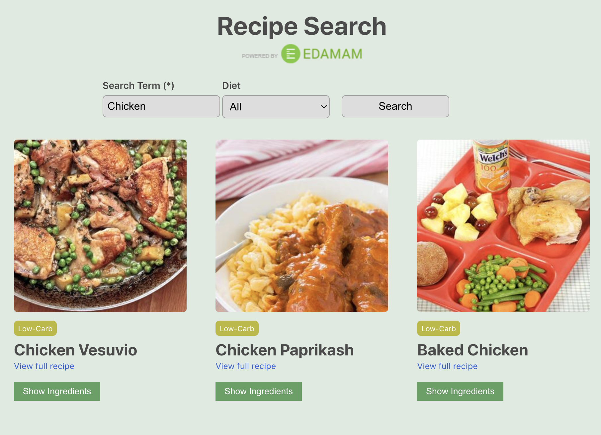

# General Assembly JavaScript Course - Unit 3 Project

This project uses **React** and the **[Edamam API](https://www.edamam.com/)** to let users search for recipes. Users may filter by diet, view ingredients and read full reciptes.

